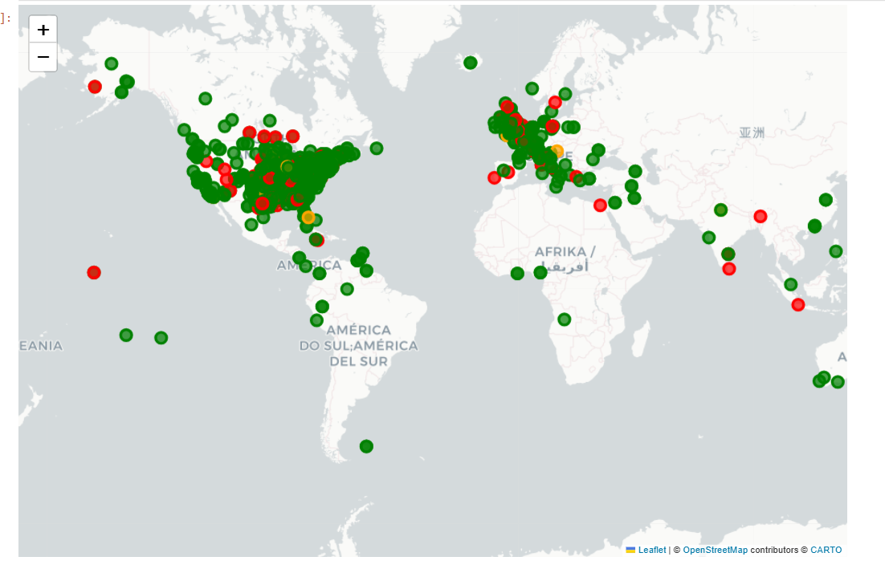

# 🌞 Solar Energy Production Zone Clustering

## 📖 Project Overview
This project applies **Machine Learning (K-Means Clustering)** to analyze and group geographical regions based on their solar energy production capacity.  
The objective is to identify high, medium, and low solar energy zones to support data-driven investment and planning decisions.

---

## 🎯 Problem Statement
To cluster geographical regions using:
- Latitude
- Longitude
- Expected Annual Energy Generation (MWh)

The goal is to identify hidden patterns in solar production and support strategic site selection.

---

## 🛠️ Technologies Used
- Python
- Pandas
- NumPy
- Scikit-learn
- Matplotlib
- Seaborn
- Jupyter Notebook

---

## ⚙️ Methodology

1. Data Cleaning & Preprocessing
2. Feature Selection
3. Data Scaling using StandardScaler
4. K-Means Clustering
5. Elbow Method for optimal cluster selection
6. Silhouette Score evaluation
7. Visualization using scatter plots, heatmaps, and maps

---

## 📊 Visual Outputs

### Elbow Method

### Correlation Heatmap

### Cluster Map

---

## 🧠 Cluster Interpretation

- 🟢 High Energy Zones → High production & strong investment potential
- 🔴 Emerging Zones → Moderate production & growth potential
- 🟡 Low Energy Zones → Low production & need optimization

---

## 💼 Business Impact

- Identifies high ROI solar regions
- Supports strategic investment decisions
- Reduces financial risk
- Optimizes infrastructure planning
- Enables data-driven expansion strategy

---

## 3. Open the notebook and run all cells.

---

## 👤 Author
Subodh Kumar  
Data Science & Machine Learning Enthusiast

